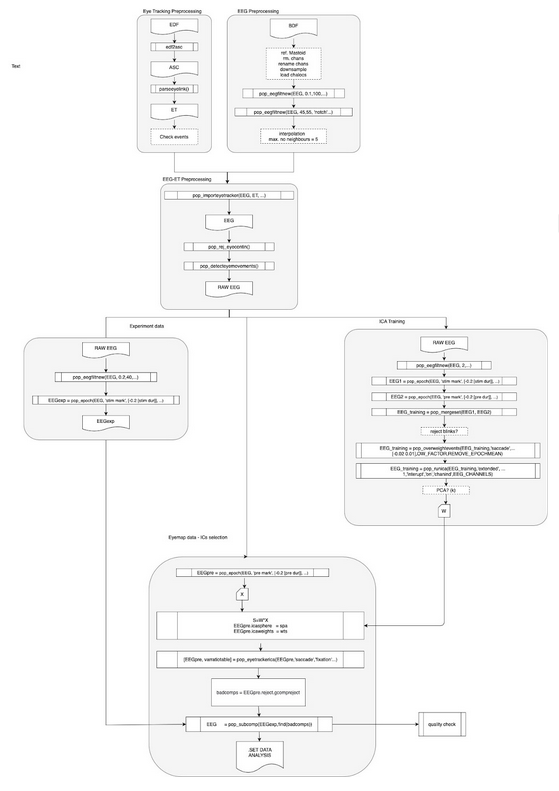
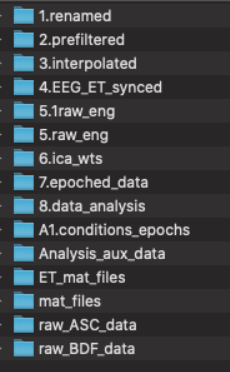

# Pre-processing pipeline for the Active Search experiment
## 1.Introduction
Recording concurrent EEG and eyetracker data provides a rich framework to study natural vision and visualsearch. However, EEG data from these experiments is known to be highly polluted by different potentials related to eye movements which produce spurious effects on data. One well known technique used to improve the signals is ICA that enables us to find a linear transformation of data into a space where artifacts may be found in a few components and then removed before coming back to original space.

In order to capture as much as possible from the non desired patterns one option is to carry out a pre-experiment or eyemap to overweight these effects on training and also to have determined windows to later recognize the ICA components  more susceptible to these known exaggerated eye movements (Plöchl). 

Here we mainly use for filtering and training the parameter suggested by Dimingen in OPTICAT where he presented an improved version of the classic ICA use for cleaning the signal from eye artifacs. The method includes an overweighting step, before ICA training, for spike artifacs we also used here. Although the way we chose to use the ICA trained data was to apply Plöch variance criteria only on eyemap/pre-experiment data to detect ocular artifact related components. Afterwards these selected ICA components were removed from the analysis dataset.

## 2.Chart for the pre-analysis pipeline

## 3. Block description

### General description

The pipeline is made of six blocks, each of which contains different functions. In an attempt to keep the code compact as well as having acces to any function independently we wraped these functions in a class called FP_basePreAnalysis. 

Eyetracking preprocessing block

The EDF files are transduced into ASC files and then parsed using parseeyelink.m funtion from eye-eeg toolbox of MATLAB. Here we checked marks that would be used later to sychronize (e.g.: eyemap , preexperiment). Parsed data is store in ET structure.

In Nottingham data marks where not correctly parsed so I had to look for relevant events (eyemap) and reasing values to them a user defined function were apply automatically after parseeyelink.m for this purpose when in mode =’dac’  the function ET_preprocessing were run.

### EEG preprocessing block

First a custom deffined function EEG_preprocessing() is to cheked if the number and name of channels is correct based on Mode property value. Then the EEG_prefiltering()  is called which implements the notch filter  to eliminate power-line noise and a bandpass filter.

  fp. cfg.lineFreq             =  50; %the notch filter would use [ 47.5, 52.5] 
  fp.cfg.preFilterEdges        = [0.1 100];

The filter edges were chosen following recomendations of the OPICAT analysis in NeuroImage 207 (2020) 116117. The idea is to preserve ocular artifact ralated information to be captured later by ICA. Interpolations were carried out according to the array badchanlist.

E.g.:

badchanslist = {'EEGEYEE01', [52];
                         'EEGEYEE02', [28 2];
                         'EEGEYEE03', [34 52 54];
                         ……}
 

### EEG-ET preprocessing block

This block is basically a pipeline of three functions from eye-egg toolbox which implement sequentially the synchronization of EEG and ET data , rejection of bad data (actually it was rather marked for future rejection as ‘Bad_data’) and the algorithm of eye movement detection proposed in Engbert & Mergenthaler, 2006. This was carried out by fp.EEG_ET_sync()  and fp.engbertDetection()  functions, the relevant configuration values in this step are.

  fp.cfg.inFileEEG = [folderIn suj '.set'];
  fp.cfg.inFileET  = [ etMATfolder suj 'ET.mat'];
  fp.cfg.eye       = 'L';%eye to be used  'L'

Each user can here define a way to rename events relevant to synchronization fn.renameEEGevents(EEG).
The functions for rejection and recognition have several parameters that were chosen following recomendations from the toolbox documentation. When the function pop_importeyetracker() is run a figure pops showing the amount of marks that were matched and a histogram of errors to measure the quality of synchronization.
At the end of this block we have our RAW EEG already synchronyze.

### ICA training block

The goal here is to prepare data to let ICA “learn” as much as possible about artifacs, keeping high frequencies that would seem uninteresting regarding ERPs and overweighting some specific events is a way of enhancing this learning.
First a high-pass band filter is applied to the data to avoid adverse known results on ICA training explored in OPTICAT paper. The fp.trainICA() function implements the filter and then creates a continuous data out of stimuli epochs and eyemap (preexperiment) epochs. This function also implemets bad data rejection, previously marked as so, and the overweighting of spikes provided by eye-eeg toolbox function pop_overweightevents(). Finally it runs binica() with PCA depending on the initial and final amount of channels and the amount of interpolated channels so that no singular matrix is obtained on ICA iterations. The output of the block is:

  weights.sph = sph;
  weights.wts = wts;

### Experiment data block

This branch is devoted to data that is going to reach the end of the pipeline transformed into the data analysis set. The function fp.epochData() implements a band-pass filter (we used [0.2 40] as frequency edges) and the pop_epoch() function contruct epochs with stimuli parts of the data so that we passed the relevant marks and trail information.

        postFilterEdges    = obj.cfg.postFilterEdges;
        chanlocsFilePath  = obj.cfg.chanlocsFilePath;
        noFiltAnalog         = obj.cfg.noFiltAnalog;
        stimMark               = obj.cfg.stimMark; 
        preMark                = obj.cfg.preMark; 
        trialDur                 = obj.cfg.trialDur;

### ICs selection block

This block combines the three outputs from previous blocks and rejects ICA components from the data analysis set in order to filter out ocular artifacts. First, the function fp.selectIcPlochl() takes the raw data coming from EEG-ET preprocessing block and extracts eyemap/pre-experiment epoched data to apply the Plöchl criteria. Before doing that  old ICA data is deleted  from de EEG estruct and learnt weights and sphere data are added, then  pop_eyetrackerica() from eye-eeg is run. Parameters needed here are the location of raw synchronized data and:

 fp.cfg.weights 

Lastly, the function fp.removeComp() takes the selected componets and the output from experiment data block as arguments:

fp.cfg.badcomp      = EEG.reject.gcompreject

## 4. Data storage structure used

Numerated folders for each step of the script are created in order to store the results:

## 5. Pre-analysis script use

Local path with the location of raw bdf and raw et data should be added to the add_path fuction from dep folder.

Some blocks were implemented in several sections mainly because of the need of visual inspection between steps to control for quality and validate the actions. 

ET events recognition and renaming check:

